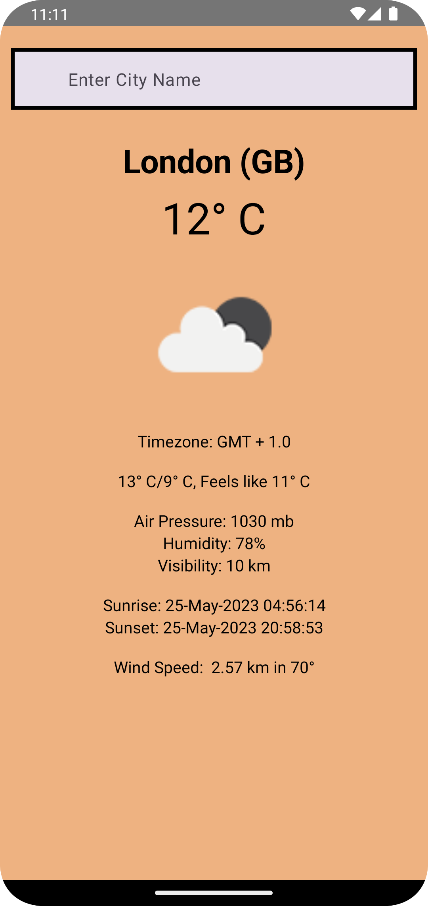
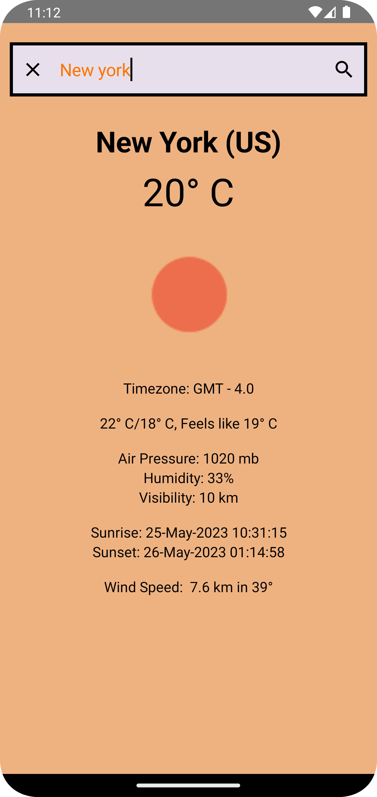

# Day To Night

Day To Night is an weather Api.

I have used MVVM architecture .
I used DI methoad and Repository to fetch the Api data.
I used Composable for UI Design.

This Api as:

* City
* Temperature
* Timezone
* Feels Like
* Humidity
* Air Pressure
* Wind Speed

  
  
  

Weather Application is still under development in testing

Libraries:
* Compose Toolkit
* Hilt
* Dependency Injection
* Kotlin Coroutines

Copyright 2023 Praveen Krishnamoorthy

